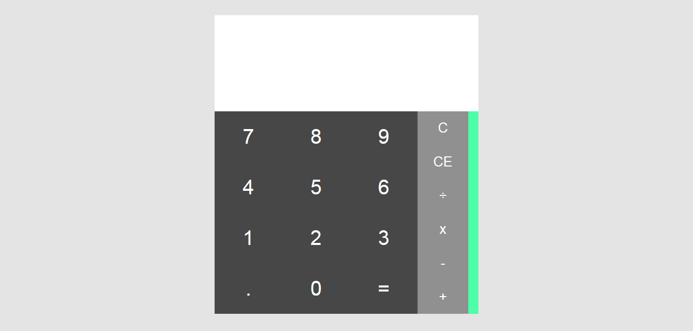
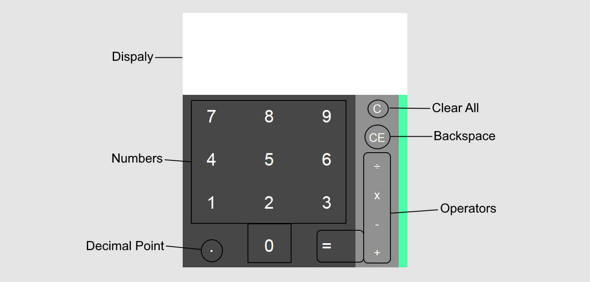

# Calculator

My solution to [The Odin Project's "Calculator" exercise](https://www.theodinproject.com/courses/web-development-101/lessons/calculator)

[Live Preview](https://araut9.github.io/Calculator/)

## What it does

- A simple calculator app with a UI that looks similar to the calculator found on old android devices.
- It can do all the basic arithmetic like addition, substraction, multiplication, and division on both integers and floating point numbers.
- It can accurately evaluate expressions with multiple operators.

## Screenshots

1. Screenshot

2. Screenhot with information about various buttons

## Technologies Used
- HTML
- CSS
- JavaScript

## Contributing

Pull requests are welcome. For major changes, please open an issue first to discuss what you would like to change.

## License

This project is licensed under the MIT License - see the [LICENSE.md](LICENSE.md) file for details

